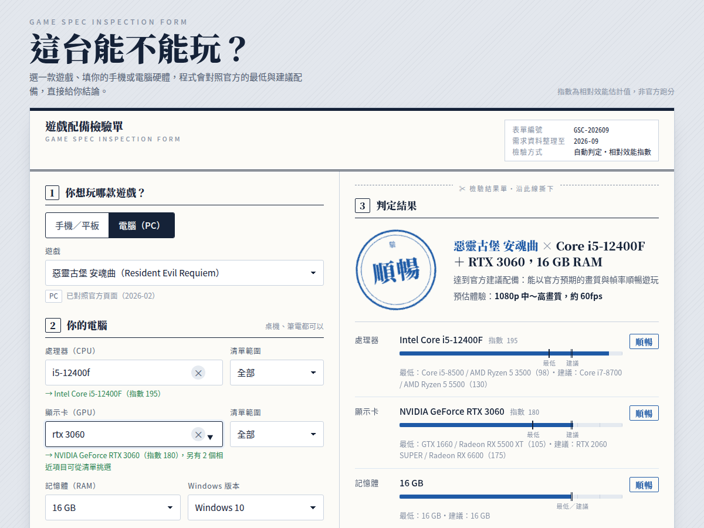

# 這台能不能玩？— 遊戲配備檢測

選一款遊戲、填你的手機或電腦硬體，網頁會對照官方的最低與建議配備，直接給你結論：**不可／勉強／可玩／順暢／極佳**。

純靜態網頁（HTML + CSS + JavaScript），沒有框架、沒有 build step、不需要伺服器，直接放上 GitHub Pages 就能用。



## 功能

- **手機／平板**：從品牌→型號選（台灣販售版本的晶片與記憶體），或直接輸入處理器；iOS 看 Apple 晶片世代、Android 看 SoC。
- **電腦**：CPU、GPU 模糊輸入（打「4060」「i5 12400」「驍龍 8 gen 3」都對得到）、清單篩選桌機／筆電／內顯、RAM、Windows 版本、SSD／HDD、可用空間。
- **145 款遊戲**：PC／Steam 大作、線上遊戲、手遊；手遊若有官方電腦版、Google Play Games（PC）或可用模擬器，PC 端也能檢測，並標明遊玩方式。
- **判定結果**：印章式結論、每個零件相對於官方最低／建議／高規配備的位置、畫質與幀率預估、官方需求對照表與來源、一鍵複製文字、列印／存成 PDF。
- **自訂遊戲**：清單裡沒有的遊戲可手動填寫需求（或用 AI 查官方需求自動填表），可匯出／匯入 JSON。

## 判定怎麼來的

每顆 CPU、顯示卡、手機晶片都有一個「相對效能指數」（依公開跑分整理的估計值）：

| 硬體 | 指數基準 |
|---|---|
| PC 顯示卡 | GTX 1060 6GB = 100 |
| PC 處理器 | ≈ PassMark 多核分數 ÷ 100 |
| 手機晶片 | ≈ 安兔兔 v10 分數 ÷ 10000 |

遊戲的官方最低與建議配備換算成同一套指數後，看你的硬體落在哪裡：

| 等級 | 意義 |
|---|---|
| 不可 | 低於官方最低配備，可能無法啟動或幾乎無法遊玩 |
| 勉強 | 只勉強達到最低配備，最低畫質也可能卡頓，不建議 |
| 可玩 | 介於最低與建議配備之間，中低畫質可以正常玩 |
| 順暢 | 達到官方建議配備 |
| 極佳 | 遠超建議配備（或達官方高規配備） |

- 整體結論取最弱的零件（瓶頸）；記憶體只會拉低結論，不會單獨把結論推到「極佳」。
- 官方沒寫建議配備的遊戲，以「最低 × 1.6」估算並標「估」。
- 硬碟空間不足只提醒、不影響結論；遊戲要求 SSD 卻裝在 HDD，結論最高只給「可玩」。
- 模擬器與 Google Play Games 只公布最低需求，建議欄為估算，且都需要在 BIOS 開啟虛擬化（VT）。

指數是估計值，散熱、驅動、遊戲改版都會影響實際體驗，請以各遊戲官方公告與實測為準。

## 專案結構

```
index.html            頁面
css/style.css         樣式（驗機規格單風格，含列印樣式）
js/config.js          設定：版本、資料日期、GitHub 連結、AI 查詢的 API 金鑰
js/data-hardware.js   硬體資料庫：GPUS / CPUS / SOCS（名稱＋相對效能指數）
js/data-phones.js     手機／平板型號 → 晶片、記憶體
js/data-games.js      遊戲需求資料庫（PC / Android / iOS）
js/engine.js          判定引擎（純函式，可用 node 測試）
js/ui.js              介面：清單、模糊比對、結果渲染、自訂遊戲、匯出匯入、複製、列印
tools/bundle.js       把整個專案打包成單一 HTML（dist/game-spec-checker.html）
docs/screenshot.png   README 用截圖
```

腳本載入順序固定：`config → data-hardware → data-phones → data-games → engine → ui`。

## 部署到 GitHub Pages

1. 建一個新的 repository，把這個資料夾的內容全部上傳（`index.html` 要在根目錄）。
2. 到 **Settings → Pages**，Source 選 **Deploy from a branch**，Branch 選 `main`、資料夾選 `/ (root)`，按 Save。
3. 一兩分鐘後網址會是 `https://<你的帳號>.github.io/<repo 名稱>/`。
4. 到 `js/config.js` 把 `REPO_URL` 填成你的 repo 網址，頁面上就會出現 GitHub 連結。

不需要 Actions、不需要 build。本機測試直接用瀏覽器開 `index.html` 即可（`file://` 也能跑）。

想要單一 HTML 檔（例如丟到 Netlify Drop 或直接傳給朋友）：

```
node tools/bundle.js
```

會產生 `dist/game-spec-checker.html`，把 CSS 與所有 JS 內嵌進去。

## 新增遊戲

打開 `js/data-games.js`，在對應分類複製一筆修改即可：

```js
{id:'mygame',n:'遊戲中文名',en:'English Name',cat:'單機大作／動作 RPG',verified:false,upd:'2026-09',
 src:'https://store.steampowered.com/app/xxxx/',srcName:'Steam 商店頁',
 pc:{os:'win10',
     min:{cpu:['Intel Core i5-8400','AMD Ryzen 5 2600'],gpu:['NVIDIA GeForce GTX 1060 6GB','AMD Radeon RX 580'],ram:16},
     rec:{cpu:['Intel Core i7-10700','AMD Ryzen 5 5600'],gpu:['NVIDIA GeForce RTX 3060','AMD Radeon RX 6600 XT'],ram:16},
     disk:80,ssd:'rec',note:'DirectX 12'},
 android:{min:{soc:['Snapdragon 855'],ram:6,os:10},rec:{soc:['Snapdragon 8 Gen 2'],ram:8},disk:20},
 ios:{min:{chip:'Apple A13 Bionic',ram:4,os:15},rec:{chip:'Apple A16 Bionic',ram:6},disk:20}},
```

- 硬體名稱必須與 `js/data-hardware.js` 裡的 `n` **完全一致**；同一層列多個同等硬體時，門檻取其中最低分。
- 沒有的平台就不要寫那個欄位；沒有 `rec` 會自動以最低 × 1.6 估算。
- 任一層加 `est:true` 代表該層是估算，畫面會標「估」；`high` 層（選填）給官方的高規／4K 配備。
- 手遊在 PC 上遊玩的方式寫在 `pc.via` 與 `pc.viaKind`（`official` 官方電腦版 / `gpg` Google Play Games / `emu` 模擬器）。
- 分類名稱（`cat`）就是下拉選單的群組，可自由新增。

也可以不改程式：網頁最下方「清單裡沒有的遊戲？」可以手動填表加入、匯出 JSON；匯出的 JSON 格式與上面相同，整理好後貼進 `data-games.js` 即可。

## 新增硬體

`js/data-hardware.js`：

```js
{n:'NVIDIA GeForce RTX 5060 Ti',s:290,v:16,g:'NVIDIA 桌上型'},   // GPU：s 指數、v 顯示記憶體 GB、g 分類
{n:'Intel Core i5-14400',s:260,g:'Intel 桌上型'},                 // CPU
{n:'Snapdragon 8 Gen 3',s:210,b:'Qualcomm'},                       // 手機晶片；Apple 晶片要加 ios:true
```

`generic:true` 的「泛指」項目只給遊戲需求對照用，不會出現在使用者的清單裡。手機型號在 `js/data-phones.js`，`soc` 要對得上 `SOCS` 的名稱。

## AI 查詢官方需求（選用）

「用 AI 幫你查」會呼叫 Anthropic API 上網查該遊戲的官方需求並自動填表。部署後需要在 `js/config.js` 的 `AI_CONFIG.apiKey` 填入金鑰才會動作。**金鑰會直接暴露在前端程式碼裡，只適合自己用的私人頁面**；公開網站請留空，按鈕會顯示失敗訊息，手動填表不受影響。

## 資料來源

已對照官方頁面的遊戲在畫面上標「已對照官方頁面」，其餘標「依公開資料整理，請以官方為準」；每款遊戲的來源網址在 `data-games.js` 的 `src`。硬體指數為估計值，非官方跑分。遊戲名稱與商標屬各自權利人所有。

## 授權

MIT License。
